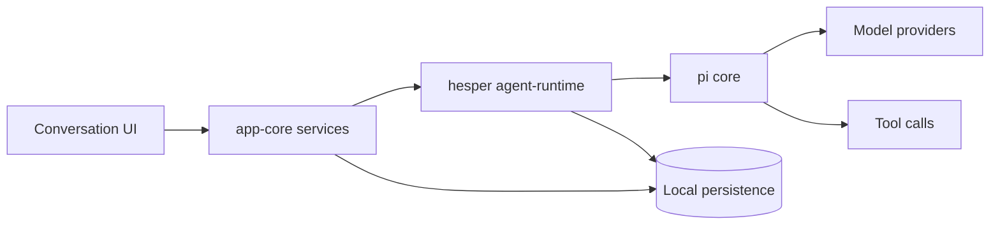
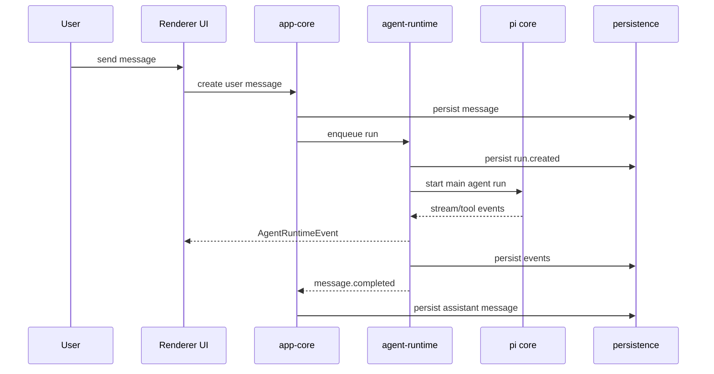

# hesper desktop MVP1 设计规格

**日期：** 2026-06-10  
**产品名：** hesper  
**桌面端目录：** `hesper-desktop/`  
**状态：** 待用户审阅  

## 1. 目标

MVP1 要交付一个稳定、可扩展的桌面端基础版本：用户可以在本地桌面应用中创建会话、选择工作目录和模型、输入消息、运行单会话 Agent 回合、查看步骤流和最终输出，并在网络中断或模型流中断时获得明确的重试体验。

第一版不追求一次性复刻完整 Craft Agent，而是建立长期可演进的产品地基。后续 roles、skills、subagent、更多工具、云端环境、Docker 环境、移动端和后端同步都应能在当前架构上自然扩展，而不是推翻重写。

## 2. 非目标

MVP1 明确不完整实现以下内容：

- 完整 skills 安装、删除、更新 UI。
- 完整角色编辑器和复杂角色路由策略。
- 多 subagent 并行执行 UI。
- 工具市场或第三方插件市场。
- 云端环境、Docker 环境、远程执行环境。
- 后端同步、账号体系、移动端。
- 完整权限系统。

这些能力需要预留数据模型、接口和事件扩展点，但不进入 MVP1 的完整交付范围。

## 3. 架构决策

采用 **B：模块化内核架构**。

核心原则：

- Electron 只做桌面壳、窗口管理、preload、安全 IPC 和系统能力桥接。
- UI 只做渲染、输入、局部交互状态和可视化反馈。
- 应用状态、会话、设置、roles、skills、tools catalog 由 `app-core` 管理。
- Agent 执行基于 **pi core**，hesper 不自研一套 Agent 内核。
- `agent-runtime` 封装 pi core，把 pi core 的执行过程转成 hesper 的事件模型、步骤流、队列、重试和持久化接口。
- 本地数据写入统一走 `persistence`，UI 和 runtime 不直接读写数据库文件。



## 4. 推荐目录结构

所有桌面端相关代码放在 `hesper-desktop/` 下：

```text
hesper/
└─ hesper-desktop/
   ├─ apps/
   │  └─ desktop/
   │     ├─ electron/
   │     ├─ renderer/
   │     └─ tests/
   ├─ packages/
   │  ├─ shared/
   │  ├─ ui/
   │  ├─ app-core/
   │  ├─ agent-runtime/
   │  ├─ tools/
   │  └─ persistence/
   ├─ docs/
   │  ├─ architecture/
   │  └─ decisions/
   ├─ package.json
   ├─ pnpm-workspace.yaml
   └─ tsconfig.base.json
```

### 模块职责

#### `apps/desktop`

- Electron main process。
- 自定义窗口和顶部拖动栏。
- preload 安全桥。
- renderer app 入口。
- IPC 路由转发。
- 文件/目录选择器。
- 应用启动、退出、崩溃恢复入口。

#### `packages/ui`

- 高信息密度三栏布局组件。
- 会话列表、功能栏、详情区。
- 聊天消息、步骤流、警告块。
- 输入框、模型选择、工作目录选择。
- markdown/html 输出容器。
- 全屏输出 viewer。
- 亮色/暗色主题 tokens。

#### `packages/app-core`

- `SessionService`：会话创建、选择、标题编辑、归档、软删除。
- `ConversationService`：消息写入、run 队列、当前会话状态聚合。
- `SettingsService`：默认模型、默认输出格式、主题、快捷键设置。
- `RoleService`：内置角色和角色数据模型。
- `SkillService`：skills 发现、读取、列表、`@skills` 数据通道。
- `ToolCatalogService`：工具定义、工具分类和可用性查询。

#### `packages/agent-runtime`

- 基于 pi core 启动主 agent run。
- 管理 run 生命周期：queued、running、succeeded、failed、cancelled。
- 管理 FIFO 运行队列。
- 把 pi core 的流式输出、工具调用和错误转成 `AgentRuntimeEvent`。
- 管理自动重试策略。
- 为后续 subagent tree 预留 `parentRunId` 和 child run 事件。

#### `packages/tools`

- 内置工具 registry。
- MVP1 工具分类：filesystem、git、web、agent、system。
- 每个工具通过统一 `ToolDefinition` 暴露 id、名称、说明、输入 schema 和分类。
- 具体工具执行可先接入最小 mock/adapter，真实工具能力分阶段补齐。

#### `packages/persistence`

- 本地 SQLite 或等价嵌入式存储封装。
- repository 接口。
- migration 机制。
- 事件和消息持久化。
- 软删除和归档状态。

#### `packages/shared`

- 通用类型。
- IPC schema。
- runtime event schema。
- result/error helper。
- 时间、id、序列化工具。

## 5. MVP1 功能范围

### 桌面应用基础

- Electron 应用可启动。
- 自定义顶部拖动栏替代系统标题栏。
- 顶部右侧提供最小化、最大化、关闭按钮。
- 支持亮色和暗色两套护眼主题。
- 应用重启后恢复最近会话和基础设置。

### 三栏式布局

- 最左侧功能栏包含：新建会话、所有会话、技能、角色、工具、设置。
- 中间列表栏根据功能栏切换：会话列表、技能列表、角色列表、工具列表、设置列表。
- 右侧详情区展示最近点击的内容。
- 默认详情区为会话界面。
- 布局风格采用高信息密度、原生桌面感、护眼易读方向。

### 会话系统

- 新建会话。
- 选择会话。
- 编辑会话标题。
- 归档会话。
- 软删除会话。
- 为会话设置工作目录。
- 为会话设置默认模型。
- 为会话设置输出模式：markdown 或 html。
- 预留会话文档区数据结构；MVP1 可先显示入口和只读占位。

### 单会话 Agent 闭环

- 用户输入消息。
- 创建 `AgentRun`。
- 基于 pi core 执行主 agent run。
- 流式展示执行进度。
- 展示思考、模型调用、工具调用、工具结果、重试、警告等步骤。
- 生成最终 assistant message。
- 运行中用户再次输入时创建 queued run。
- 当前 run 结束后自动执行队列中最早的 run。

### 输出展示

- 支持 markdown 渲染。
- 支持 html sandbox 渲染。
- 输出块固定高度，可内部滚动。
- 鼠标 hover 输出块时显示扩展按钮。
- 点击扩展按钮进入全屏查看。
- 全屏查看支持独立滚动、复制内容、关闭返回。

### 错误恢复

- 模型或网络瞬断时自动重试，最多 5 次。
- 每次重试在步骤流中可见。
- 重试成功后继续当前 run。
- 5 次仍失败时 run 标记为 failed。
- 失败后显示警告块和“重试此回合”按钮。
- 点击重试会创建新的 run，并复用原用户输入、模型、工作目录和上下文设置。
- 失败 run 保留为历史，不覆盖已有消息。

### 扩展预留

- skills：MVP1 做发现、读取、列表、`@skills` 数据通道。
- roles：MVP1 做内置角色、角色模型、默认模型和 allowed skills 字段。
- tools：MVP1 做工具 registry、工具 schema 和工具调用事件模型。
- subagent：MVP1 不实现完整并行 UI，但事件模型支持 parent/child run。

## 6. UI 设计要求

UI 方向已确认：**信息密度高，但必须舒服、易读、易用**。

### 视觉风格

- 更像原生桌面应用，减少网页感。
- 顶部栏较薄。
- 侧栏列表更紧凑。
- 消息间距收紧但保留清晰行高。
- 使用柔和护眼背景，避免大面积纯白。
- 使用低对比边框、清晰分组和状态 badge。
- 圆角和阴影克制，不做过度卡片化。

### 会话界面

- 顶部中间显示会话标题。
- 顶部右侧显示导航、会话文档、输出格式入口。
- 用户消息靠右，用圆角矩形包裹。
- Agent 步骤流显示在用户消息下方。
- 最终回复块与底部输入框视觉宽度保持一致。
- 输出块内部滚动，消息区外部滚动。

### 输入框

- 默认约 5 行高度。
- 输入框是圆角矩形。
- 输入内容超过默认高度时向上扩展。
- 最大扩展到约 10 行。
- 超过最大高度后输入框内部滚动。
- 左下角显示工作目录选择。
- 右下角显示模型选择和输出模式选择。
- 右侧圆形发送按钮居中显示向上箭头。
- 无输入内容时发送按钮置灰。
- 支持 `@skills`。

### 步骤流

步骤流第一行包含：

- 展开/收起 icon。
- 步骤数量 pill。
- 当前步骤摘要，单行截断。

展开后每行包含：

- 左侧时间线或缩进。
- 状态 icon。
- 工具或命令摘要。
- 可选耗时。

状态 icon：

- 思考：空心消息或圆点。
- 成功：绿色圆形勾。
- 失败：红色叉。
- 重试：黄色或蓝色状态。

### 右侧导航

MVP1 做轻量版本：

- 顶部有“导航”入口。
- 点击后打开右侧 panel。
- panel 中列出用户消息、assistant 输出、失败/警告块、工具调用节点。
- 点击导航项滚动到对应消息或步骤。

后续可扩展为 run tree、subagent tree、文档目录、输出块目录和搜索定位。

### 快捷键

MVP1 支持：

- `Ctrl/Cmd + Enter`：发送消息。
- `Esc`：关闭全屏输出或右侧导航。
- `Ctrl/Cmd + K`：快速切换会话或功能。
- `Alt + ↑/↓`：上一条/下一条消息。
- `Alt + Shift + ↑/↓`：上一条/下一条 Agent 输出。
- 按住指定快捷键配合滚轮快速滚动会话内容。

快捷键处理放在独立模块，后续可以用户自定义。

## 7. 数据模型

```ts
type Session = {
  id: string
  title: string
  status: 'active' | 'archived' | 'deleted'
  workspacePath?: string
  defaultModelId?: string
  outputMode: 'markdown' | 'html'
  createdAt: string
  updatedAt: string
}

type Message = {
  id: string
  sessionId: string
  role: 'user' | 'assistant' | 'system'
  content: string
  contentType: 'markdown' | 'html' | 'plain'
  runId?: string
  createdAt: string
}

type AgentRun = {
  id: string
  sessionId: string
  parentRunId?: string
  status: 'queued' | 'running' | 'succeeded' | 'failed' | 'cancelled'
  modelId: string
  workspacePath?: string
  retryCount: number
  maxRetries: number
  startedAt?: string
  endedAt?: string
  error?: RunError
}

type RunStep = {
  id: string
  runId: string
  type: 'thought' | 'tool_call' | 'tool_result' | 'model_call' | 'retry' | 'warning'
  status: 'pending' | 'running' | 'succeeded' | 'failed'
  title: string
  summary?: string
  detail?: string
  createdAt: string
  completedAt?: string
}

type Skill = {
  id: string
  name: string
  description?: string
  source: 'builtin' | 'workspace' | 'project'
  path?: string
}

type Role = {
  id: string
  name: string
  description?: string
  defaultModelId?: string
  allowedSkillIds: string[]
  canBeMainAgent: boolean
  canBeSubagent: boolean
}

type ToolDefinition = {
  id: string
  name: string
  description: string
  inputSchema: unknown
  category: 'filesystem' | 'git' | 'web' | 'agent' | 'system'
}
```

## 8. Runtime 事件流

UI 订阅 runtime 事件流，而不是等待单个函数返回。

```ts
type AgentRuntimeEvent =
  | { type: 'run.created'; run: AgentRun }
  | { type: 'run.started'; runId: string }
  | { type: 'step.created'; step: RunStep }
  | { type: 'step.updated'; step: RunStep }
  | { type: 'message.delta'; runId: string; delta: string }
  | { type: 'message.completed'; message: Message }
  | { type: 'run.retrying'; runId: string; retryCount: number; nextRetryAt: string }
  | { type: 'run.failed'; runId: string; error: RunError }
  | { type: 'run.succeeded'; runId: string }
```

事件流要求：

- 所有 runtime 事件都可持久化。
- 刷新窗口后 UI 可以根据事件和聚合状态恢复。
- 工具调用失败必须显示在步骤流。
- `message.delta` 作为临时流式状态，不直接污染最终历史。
- 只有 `message.completed` 后才写入最终 assistant message。



## 9. 队列和中间插话

MVP1 队列规则：

- 当前会话没有 running run：新输入立即创建并执行 run。
- 当前会话已有 running run：新输入创建 queued run。
- queued run 使用 FIFO 顺序。
- 当前 run 结束后自动执行队列中最早的 run。
- UI 显示“已排队”状态。
- MVP1 不做优先级、取消队列重排或复杂依赖。

## 10. 重试策略

```ts
type RetryPolicy = {
  maxRetries: 5
  initialDelayMs: 1500
  backoffMultiplier: 1.6
  retryableErrors: [
    'network_error',
    'timeout',
    'rate_limit_transient',
    'stream_interrupted'
  ]
}
```

行为：

1. pi core 或模型 provider 报告可重试错误。
2. `agent-runtime` 记录 `run.retrying`。
3. UI 显示“正在重连，第 N/5 次”。
4. 重试成功后继续当前 run。
5. 5 次仍失败时记录 `run.failed`。
6. UI 显示警告块和“重试此回合”按钮。
7. 点击重试创建新的 run，保留原失败 run。

## 11. 技术栈

- Runtime language：TypeScript。
- Desktop：Electron。
- Agent core：pi core。
- UI：React + Vite。
- Package management：pnpm workspace。
- Styling：CSS variables + theme tokens。可在实现计划中决定是否引入 Tailwind，但 MVP1 不依赖 Tailwind 才能成立。
- Validation：zod 或 valibot，用于 IPC/event schema。
- Persistence：SQLite 或等价嵌入式本地存储，通过 repository 层封装。
- Unit/integration tests：Vitest。
- Component tests：React Testing Library。
- Electron E2E：Playwright。

## 12. 测试策略

### Unit tests

覆盖：

- shared result/error helpers。
- event schema validation。
- session service。
- settings service。
- retry policy。
- FIFO queue logic。
- role/skill/tool registry 查询。

### Integration tests

覆盖：

- 创建 session 后写入 user message。
- 创建 run 后持久化 runtime events。
- running run 存在时新输入进入队列。
- 当前 run 完成后自动执行 queued run。
- stream 中断后自动重试。
- 工具调用失败后生成 failed step。
- `message.completed` 后写入 assistant message。

### Component tests

覆盖：

- 高信息密度三栏布局渲染。
- 会话列表状态 badge 和分组。
- 输入框自动扩展到最大 10 行。
- 输出块内部滚动。
- 全屏输出 overlay。
- markdown/html 模式切换。
- 步骤流成功、失败、重试状态。
- 警告块和重试按钮。

### Electron E2E tests

覆盖：

- 启动应用。
- 新建会话。
- 编辑会话标题。
- 选择工作目录。
- 选择模型。
- 发送消息。
- 使用 mock pi core adapter 返回流式内容。
- 查看最终 assistant 输出。
- 归档和软删除会话。
- 重启应用后恢复会话列表和最近会话。

## 13. MVP1 Definition of Done

MVP1 完成时必须满足：

- 桌面应用可以启动。
- 三栏式布局可用，信息密度高且易读。
- 支持亮色/暗色主题。
- 支持会话新建、选择、标题编辑、归档、软删除。
- 支持会话工作目录选择。
- 支持模型选择。
- 支持 markdown/html 输出模式。
- 支持用户输入消息。
- 支持基于 pi core 的单会话主 agent run。
- 支持步骤流展示。
- 支持最终回复展示。
- 支持运行中插话进入 FIFO 队列。
- 支持最多 5 次自动重试。
- 失败后显示警告块和重试按钮。
- 输出块支持内部滚动和全屏查看。
- skills、roles、tools、subagent 有清晰数据模型和扩展接口。
- 核心服务、runtime、persistence、UI 主路径有自动化测试。
- Electron E2E 覆盖主路径。

## 14. 规格自审结果

- 未保留待定占位项。
- MVP1 范围和非目标边界明确。
- 架构明确基于 pi core，hesper 只做产品化封装和桌面集成。
- UI 方向明确为高信息密度、原生桌面感、护眼易读。
- 数据模型、事件流、队列和重试策略保持一致。
- 测试策略覆盖核心稳定性风险。
