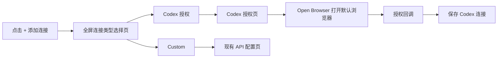

# Codex OAuth 连接入口设计

> 日期：2026-06-20 23:20 Asia/Shanghai  
> 仓库：`C:/Users/oisin/dev/hesper`  
> 范围：桌面端设置页 AI 连接新增流程

## 背景

当前 AI 设置页点击 `+ 添加连接` 后，会直接打开 API Key / Endpoint / Model 的 `API 配置`全屏弹窗。这个流程适合 Custom 连接，但不适合 Codex 授权连接。Codex 授权需要通过 Craft Agents Backend / PI OAuth 打开默认浏览器，让用户授权后通过回调保存连接。

本次目标是先让新增连接流程具备入口分流能力，并接入单一的 Codex 授权入口。不会新增 OpenAI、ChatGPT、Whisper 或通用 OAuth 等多入口。

## 用户体验

点击 `+ 添加连接` 后，不再直接进入 Custom API 配置，而是进入一个覆盖整个桌面窗口内容区的连接类型选择页。覆盖范围保留最上方 36px 标题栏，其他区域全部覆盖，视觉行为与现有 Custom 配置弹窗一致。

选择页只提供两个选项：

1. **Codex 授权**
   - 用于连接 ChatGPT Codex 授权。
   - 点击后进入 Codex 授权页面。
   - 授权页面通过默认浏览器打开 Craft Agents Backend / PI 的 `openai-codex` OAuth 授权地址。
   - 用户授权并完成回调后，应用保存 Codex 授权连接，并可用于 Codex 相关模型。

2. **Custom**
   - 用于手动填写 Endpoint、API Key 和模型。
   - 点击后进入现有 `API 配置`界面。
   - 现有 Test / Save 行为保持不变。

## 交互流程

## UI 结构

### 全屏覆盖层

新增连接选择页与现有 API 配置页都使用同类覆盖层：

- `position: fixed`
- `top: 36px`
- `left: 0`
- `right: 0`
- `bottom: 0`
- 高层级覆盖 `ActivityRail`、列表栏和详情区域
- 背景使用当前 surface/background 变量
- 顶部提供关闭按钮或 Back 按钮

这样无需重构 `AppShell`，也能精确保留标题栏。

### 连接类型选择页

组件建议命名为 `ConnectionTypePicker`，由 `ProviderSettingsPanel` 控制显示。

页面元素：

- 标题：`Add connection`
- 说明：选择一种连接方式。
- 卡片 1：`Codex 授权`
  - 描述：使用 ChatGPT Codex 授权访问 Codex 相关模型。
  - 主按钮或整卡点击：进入 Codex 授权页。
- 卡片 2：`Custom`
  - 描述：手动配置 Endpoint、API key 和模型。
  - 主按钮或整卡点击：进入现有 API 配置页。
- 底部或左上：`Back` 关闭回到 AI 设置页。

### Codex 授权页

组件建议命名为 `CodexAuthorizationDialog` 或 `CodexAuthorizationPage`。

页面元素：

- 标题：`Codex 授权`
- 连接名称输入：默认 `ChatGPT Codex`，只允许重命名。
- 状态区域：显示未授权、正在打开浏览器、等待回调、授权成功、授权失败等状态。
- 按钮：
  - `Back`：回到连接类型选择页。
  - `Open Browser`：调用后端授权启动接口，拿到授权 URL 后用默认浏览器打开。
  - `Save`：授权成功后保存连接；未授权时禁用或显示提示。

## 数据与服务边界

### OAuth provider

Codex 授权固定使用：

- `piAuthProvider: "openai-codex"`
- 默认连接名：`ChatGPT Codex`
- 连接类型：PI / Craft Agents Backend OAuth 授权连接

具体持久化字段应复用或扩展当前 model provider 配置。现有 `ModelProviderKind` 主要覆盖 API Key provider；实现时需要增加能表示 PI OAuth provider 的字段或 kind。推荐新增最小必要字段，而不是把 Codex 授权伪装成普通 OpenAI-compatible API Key 连接。

### IPC 能力

需要在 Electron IPC 层新增 OAuth 相关能力：

1. `providers.startOAuthAuthorization(input)`
   - 输入：`provider: "openai-codex"`、连接名等必要信息。
   - 输出：授权 URL、授权 session id 或 state。
   - 主进程负责调用 Craft Agents Backend / PI 授权启动接口。

2. `providers.getOAuthAuthorizationStatus(input)` 或事件订阅
   - 输入：授权 session id / state。
   - 输出：`pending | authorized | failed` 以及用户可读 message。
   - 用于渲染进程刷新授权状态。

3. `providers.saveOAuthConnection(input)`
   - 输入：授权 session id / state、连接名称。
   - 输出：保存后的 provider。
   - 保存后刷新 provider/model 列表。

如果 Craft Agents Backend / PI 已经提供“一步启动授权并在回调后自动保存”的本地 API，则以上接口可以收敛为更小的 IPC；但渲染层仍保持“打开浏览器、等待状态、保存/完成”的状态模型。

### 默认浏览器

打开授权页必须由主进程使用 Electron `shell.openExternal(url)` 完成，避免 renderer 直接操作外部导航。IPC handler 应校验 URL 来自可信授权接口，不能任意打开用户输入 URL。

## 错误处理

- 授权启动失败：显示 `授权启动失败`，保留重试按钮。
- 默认浏览器打开失败：显示 `无法打开默认浏览器`，允许再次点击。
- 回调超时或失败：显示 PI/Craft Agents Backend 返回的安全错误摘要，不展示 token、code、state 等敏感值。
- 保存失败：连接仍停留在授权成功状态，允许用户重试 Save。
- Custom 流程错误处理保持现状。

## 测试策略

遵循测试先行：

1. Renderer 测试
   - 点击 `+ 添加连接` 显示全屏 `Add connection` 选择页，而不是直接打开 `API 配置`。
   - 选择 `Custom` 后打开现有 `API 配置`，现有 Test / Save 测试继续通过。
   - 选择 `Codex 授权` 后显示 Codex 授权页。
   - Codex 页默认连接名为 `ChatGPT Codex`，可编辑名称。
   - 点击 `Open Browser` 调用 OAuth IPC，而不是保存 API Key provider。
   - 授权成功后点击 `Save` 保存 OAuth connection 并刷新 model registry。

2. IPC / 主进程测试
   - OAuth 启动 payload 只接受 `openai-codex`。
   - `shell.openExternal` 使用后端返回的授权 URL。
   - 不允许打开不可信 URL。
   - 授权状态和保存结果通过 schema 校验。

3. App-core / service 测试
   - 保存 Codex OAuth provider 不需要 API key。
   - provider 列表能显示已授权状态。
   - 验证连接对 OAuth provider 使用授权状态，而不是 API key 探测。

4. 回归测试
   - Custom 新增连接测试保持通过。
   - 编辑、重命名、删除现有连接保持通过。
   - 现有 provider API Key 测试不受影响。

## 不在本次范围

- 不新增 OpenAI、ChatGPT、Whisper 或通用 OAuth 多入口。
- 不重构整个 `AppShell`。
- 不改变现有 Custom API 配置字段和保存逻辑。
- 不在 renderer 暴露 OAuth token、authorization code 或 raw state。

## 自检

- 无未完成条目。
- 入口范围明确：只有 Codex 授权和 Custom。
- 覆盖范围明确：保留标题栏，覆盖其余整个桌面窗口内容区。
- OAuth 边界明确：接 Craft Agents Backend / PI 的 `openai-codex` 授权。
- 实现策略保持最小改动，不重构 AppShell。
