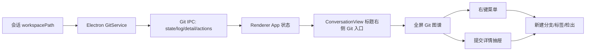

# Git 图谱面板设计

日期：2026-06-26

## 背景

当会话选择的项目目录是 Git 仓库时，会话标题右侧显示一个 Git 分支图标。用户点击图标后，打开 Git 全屏视图。这个视图不覆盖系统标题栏，只占用标题栏下方的应用内容区域，和现有全屏输出行为保持一致。

本设计经过几轮草图讨论后，放弃常驻三栏工作台，改成一栏 Git 图谱列表。默认主视图只承担一件事：快速浏览提交图谱、提交信息、日期、作者、提交 ID，以及该 commit 上的分支或 tag。更复杂的操作放进右键菜单和临时详情抽屉。

## 目标

1. 只有当前会话的 `workspacePath` 是 Git 仓库时，才显示 Git 入口。
2. Git 全屏视图只从标题栏下方展开，不改变标题栏内容。
3. 主视图是一栏列表，列为：图谱、描述、日期、作者、提交。
4. 图谱线和节点必须居中对齐，避免节点视觉偏左。
5. 分支和 tag 直接显示在对应 commit 的描述前。
6. 右键提交行时出现操作菜单，包含从选中提交新建分支、创建标签、检出、复制 Commit ID、查看提交详情。
7. 查看提交详情时打开右侧临时抽屉，不把主视图改回常驻多栏。
8. 按 Esc 时遵循层级关闭：先关右键菜单或详情抽屉，再退出 Git 全屏。
9. 颜色、背景、边框、hover、选中态都使用 Hesper 的 themeTokens，自动适配亮色和暗色主题。

## 非目标

第一版不做完整 Git 客户端，不包含 merge、rebase、stash、pull、push、冲突解决、diff 编辑器。后续可以在右键菜单或详情抽屉里逐步扩展。

## 信息架构

## 布局

### 入口

入口放在会话标题右侧，和标题一起处在 `ConversationView` 的 header 中。入口显示 Git 分支图标，可附带当前分支名。若仓库有未提交改动，可以用很小的状态点提示，但不要在标题栏展开完整状态。

### 全屏视图

全屏视图使用固定覆盖层，位置从应用标题栏下方开始：`top: 36px; right: 0; bottom: 0; left: 0`。内部不再使用卡片式弹窗，不展示项目名、当前分支、changes、刷新等顶部信息行。

主内容是一个铺满剩余空间的表格：

| 列 | 内容 |
| --- | --- |
| 图谱 | 彩色 lane、连接线、节点，节点以 lane 中心为坐标 |
| 描述 | branch/tag 徽标 + commit subject |
| 日期 | 本地格式，例如 `2026-06-26 10:24` |
| 作者 | `name <email>`，窄屏时可裁剪 |
| 提交 | short hash |

### 图谱列

图谱列内部用固定 lane 坐标渲染。每条 lane 的线和节点共享同一个 x 坐标，线使用 `transform: translateX(-50%)` 居中，节点使用 `transform: translate(-50%, -50%)` 居中，避免视觉偏移。

### 右键菜单

右键菜单绑定在提交行上。菜单项：

- 从选中提交新建分支
- 创建标签
- 检出此提交
- 复制 Commit ID
- 查看提交详情

危险或可能改变工作区状态的动作需要确认。若工作区有未提交改动，切换分支、检出和从提交新建分支前必须提示风险。

### 提交详情抽屉

详情抽屉从右侧临时滑出，不常驻。内容包括：

- commit 标题
- short hash / full hash
- 作者
- 提交时间
- parent hash
- 当前 commit 上的 branch/tag
- 完整提交信息
- 文件变更摘要
- 快捷操作：从此提交新建分支、创建标签、检出、复制 Commit ID

点击详情外区域或按 Esc 关闭详情。详情关闭后再次按 Esc 退出 Git 全屏。

## 数据和行为

### Git 仓库检测

当 `session.workspacePath` 存在时，renderer 请求 Electron 检查该路径是否是 Git 仓库。非 Git 仓库不显示入口。检测需要在工作区路径变化后重新执行，并处理目录不存在、权限不足、非 Git 仓库三种状态。

### 日志数据

Electron 侧提供结构化 Git 数据，renderer 不直接执行任意 Git 命令。第一版需要：

- 仓库状态：是否 Git 仓库、当前分支、HEAD、是否 dirty。
- 日志列表：commit hash、short hash、parents、subject、author、date、refs、图谱 lane 数据。
- 提交详情：完整 message、parent、refs、文件变更摘要。

### Git 操作

第一版支持三类操作：

- 从选中提交新建分支，可选择是否立即 checkout。
- 创建 tag。
- checkout 分支或 commit。

所有操作都在 Electron 侧白名单执行，不通过 renderer 传任意命令字符串。

## 主题

UI 组件必须使用 `themeTokens.color.*`、`themeTokens.radius.*`、`themeTokens.spacing.*` 和 CSS 变量，不写死黑色背景。亮色主题下表格背景、行 hover、选中态、tag 背景和右键菜单都要有足够对比度。

## 键盘和无障碍

- Git 入口是 button，有明确 `aria-label`。
- Git 全屏是 dialog，`aria-modal="true"`。
- 提交行可键盘选中。
- Enter 打开提交详情。
- ContextMenu 或 Shift+F10 打开右键菜单。
- Esc 先关闭最上层浮层，再关闭 Git 全屏。

## 测试范围

1. 非 Git 仓库不显示入口，Git 仓库显示入口。
2. 点击入口打开 Git 全屏，标题栏保持不变。
3. 图谱表格渲染列、branch/tag、选中态。
4. 图谱节点和 lane 使用同一坐标居中。
5. 右键菜单包含新建分支、标签、检出、复制 ID、详情。
6. 查看详情打开右侧抽屉。
7. Esc 关闭顺序正确。
8. 亮色/暗色主题下样式使用 tokens。
9. IPC 只接受 session workspace，不接受 renderer 传入任意路径越界。
