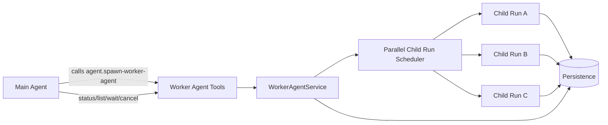
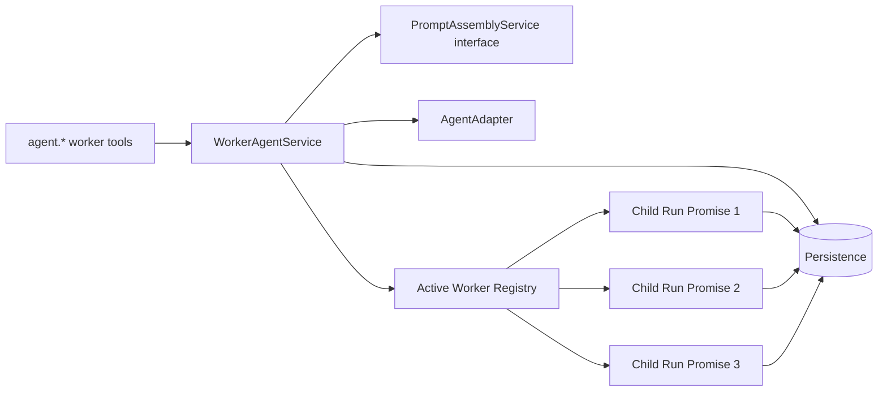
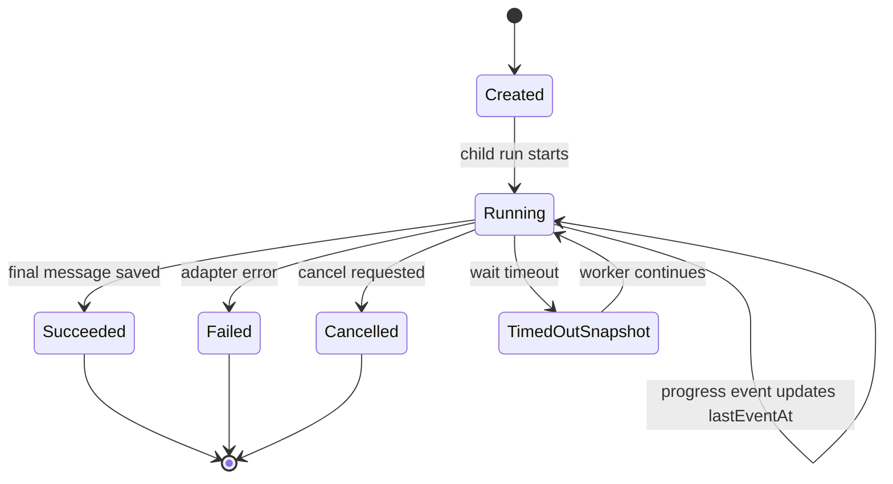
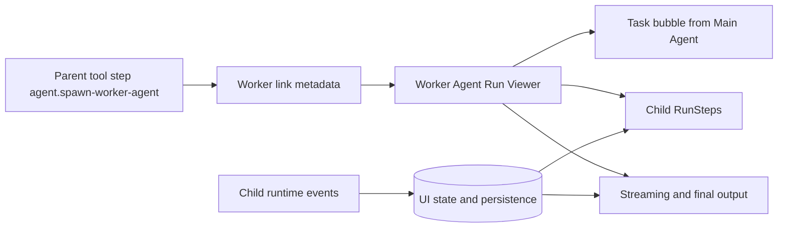

# Worker Agent 工具设计

日期：2026-06-20

## 背景

`hesper-desktop` 已经为 Worker Agent 预留了多处基础设施：

- `AgentRun` 支持 `parentRunId`、`workerAgentInvocationId`、`depth`
- 持久层已有 `worker_agent_invocations` 表
- `PromptAssemblyService` 已能组装 Worker Agent prompt
- `agent.spawn-worker-agent` 在 executor 中有 legacy 分支，但当前只返回未实现
- 内置工具列表当前未暴露 Worker Agent 执行工具

本设计将 Worker Agent 从“预留模型”推进到可用的第一版：主 Agent 可以通过工具创建 Worker Agent，并行执行任务，查看状态，等待结果，取消卡住的 Worker，并在 UI 中通过工具步骤打开 Worker 的完整执行界面。

## 目标

1. 主 Agent 能调用 `agent.spawn-worker-agent` 创建 Worker Agent。
2. Worker Agent 使用指定角色和受限工具集执行任务。
3. 多个 Worker Agent 能真正并行执行，不受当前会话 FIFO 主队列限制。
4. 主 Agent 能查询、等待、取消 Worker Agent。
5. 等待必须有界，避免 Worker 卡住导致主 Agent 永久卡住。
6. Worker Agent 严格归属于当前 session 和 parent run，不跨会话交叉。
7. 点击 `agent.spawn-worker-agent` 工具步骤时，全屏展示 Worker Agent 的执行界面，而不是普通 Input / Output JSON。
8. Worker Agent 的最终输出不污染主会话普通消息流。

## 非目标

第一版不实现：

- 自动 retry 工具
- Worker Agent 递归创建 Worker Agent
- 跨会话 Worker 管理
- 专门的 Worker Agent 侧边栏或全局管理面板
- app 重启后恢复仍在运行的 Worker Agent
- UI 中编辑 Worker 任务或实时接管 Worker

重启后仍处于 `running` 的 Worker Agent 可标记为 orphaned / unavailable，由主 Agent 重新 spawn。

## 方案选择

采用方案 1：**独立 `WorkerAgentService` + 并行 child-run scheduler**。



### 选择原因

- 与现有 `AgentRuntime` 主会话 FIFO 队列解耦，能做到真正并行。
- Worker 相关状态、等待、取消、诊断逻辑集中在一个服务边界内。
- 工具 executor 只做参数解析和 handler 委托，包边界清晰。
- 后续可扩展 retry、timeout policy、UI Worker 面板，不需要重写主 runtime。

## 架构边界



### `WorkerAgentService`

放在 `@hesper/agent-runtime`，但不直接依赖 `@hesper/app-core`，避免包循环。它通过接口注入需要的 app-core 能力：

- role lookup
- skill listing
- tool catalog listing
- prompt assembly
- global tool enablement filter
- runtime event emitter / subscriber bridge

服务职责：

- 校验 session / parent run / role / tool / depth / count
- 创建 `WorkerAgentInvocation`
- 创建 child `AgentRun`
- 组装 Worker Agent prompt
- 启动独立 child run Promise
- 维护 active Worker registry
- 提供 spawn / list / get / wait / cancel
- 更新 invocation 状态、`lastEventAt`、诊断信息

### 工具 executor

`@hesper/tools` 不依赖 `@hesper/agent-runtime`。`createBuiltinToolExecutor` 新增 `workerAgentTools` handlers 注入：

```ts
type WorkerAgentToolHandlers = {
  spawn(input, context): Promise<unknown>
  list(input, context): Promise<unknown>
  get(input, context): Promise<unknown>
  wait(input, context): Promise<unknown>
  cancel(input, context): Promise<unknown>
}
```

如果 handler 未注入，返回 controlled error，而不是抛未捕获异常。

## 工具 API

第一版提供 5 个工具。

### `agent.spawn-worker-agent`

创建 Worker Agent child run。

输入：

```ts
type SpawnWorkerAgentInput = {
  task: string
  roleId: string
  allowedToolIds: string[]
  expectedOutput?: string
  contextSummary?: string
  wait?: boolean
  timeoutMs?: number
  cancelOnTimeout?: boolean
}
```

语义：

- `wait` 默认 `true`
- `timeoutMs` 默认 60 秒，最大 5 分钟
- `cancelOnTimeout` 默认 `false`
- `wait: true` 表示创建 Worker 后有限等待，不表示无限等待
- 超时后返回 `status: "running"`、`timedOut: true` 和诊断快照
- `wait: false` 立即返回 `invocationId` / `childRunId`，Worker 后台并行执行

返回：

```ts
type SpawnWorkerAgentResult = {
  invocationId: string
  childRunId: string
  parentRunId: string
  parentStepId?: string
  status: WorkerAgentInvocationStatus
  timedOut?: boolean
  diagnosis?: WorkerAgentDiagnosis
  result?: WorkerAgentResult
  error?: RunError
}
```

### `agent.list-worker-agents`

列出当前 parent run 创建的 Worker Agent。

输入：

```ts
type ListWorkerAgentsInput = {
  parentRunId?: string
  status?: WorkerAgentInvocationStatus
}
```

默认 `parentRunId = context.runId`。

### `agent.get-worker-agent`

查询单个 Worker Agent 状态、诊断和结果。

输入：

```ts
type GetWorkerAgentInput = {
  invocationId: string
}
```

### `agent.wait-worker-agent`

有限等待 Worker Agent 到达终态。

输入：

```ts
type WaitWorkerAgentInput = {
  invocationId: string
  timeoutMs?: number
  cancelOnTimeout?: boolean
}
```

超时不等于失败。默认超时只归还主 Agent 控制权，Worker 继续后台执行。

### `agent.cancel-worker-agent`

取消正在运行的 Worker Agent。

输入：

```ts
type CancelWorkerAgentInput = {
  invocationId: string
  reason?: string
}
```

## 并发执行与等待语义

`WorkerAgentService` 维护内存 registry：

```ts
type ActiveWorker = {
  invocationId: string
  childRunId: string
  controller: AbortController
  promise: Promise<void>
  startedAt: string
  lastEventAt: string
}
```

每次 spawn 创建独立 Promise，因此多个 Worker 可以同时运行。



### 等待不能无界

所有 wait 路径都必须有默认超时和硬上限：

- 默认：60 秒
- 最大：5 分钟

如果 Worker 没结束，返回诊断快照，主 Agent 根据诊断决定继续等待、检查、取消或重新 spawn。

## 卡住诊断

超时只能说明“等待窗口内没结束”，不能证明 Worker 卡住。服务返回诊断快照：

```ts
type WorkerAgentDiagnosis = {
  progressState: 'active' | 'quiet' | 'possibly_stalled'
  lastEventAt?: string
  runningForMs: number
  idleForMs?: number
  activeStep?: {
    id: string
    type: RunStepType
    title: string
    status: RunStepStatus
    runningForMs?: number
  }
  recommendation: 'continue_waiting' | 'inspect' | 'cancel_and_retry'
}
```

第一版阈值：

- `idleForMs < 30_000`：`active`
- `30_000 <= idleForMs < 120_000`：`quiet`
- `idleForMs >= 120_000`：`possibly_stalled`

这些阈值只给建议，不自动取消，除非调用方传入 `cancelOnTimeout: true`。

## session 与 parent run 作用域

Worker Agent 必须严格绑定到 parent run：

```text
Session
  └─ Main Agent Run parentRunId
       ├─ Worker Invocation A -> Child Run A
       ├─ Worker Invocation B -> Child Run B
       └─ Worker Invocation C -> Child Run C
```

规则：

1. Worker Agent 继承 parent run 的 `sessionId`、`workspacePath`、output mode 和 session 限制。
2. `list` 默认只列出当前 `context.runId` 创建的 Worker。
3. `get` / `wait` / `cancel` 必须校验目标 invocation 所属 parent run 的 `sessionId === context.sessionId`。
4. 跨 session 操作返回权限错误。
5. 同 session 内显式传 `parentRunId` 可查看历史 run 的 Worker，但 prompt 中要求主 Agent 优先管理当前 run 创建的 Worker。

## 角色、工具与权限

### role 校验

`roleId` 必须满足：

```ts
role.canBeWorkerAgent === true
role.canBeAssignedToWorkerAgent !== false
session.allowedWorkerAgentRoleIds.includes(roleId)
```

### 工具交集

Worker 的实际工具集为：

```ts
effectiveAllowedToolIds =
  requestedAllowedToolIds
  ∩ parentRun.enabledToolIds
  ∩ workerRole.defaultToolIds
  ∩ globallyEnabledToolIds
```

如果交集为空，spawn 失败。

### Worker 工具不下放

第一版 Worker 不允许再创建 Worker。默认从 Worker 工具集中排除：

- `agent.spawn-worker-agent`
- `agent.list-worker-agents`
- `agent.get-worker-agent`
- `agent.wait-worker-agent`
- `agent.cancel-worker-agent`

### count 与 depth

- `maxWorkerAgentsPerRun` 默认 64，按 parent run 统计。
- 主 Agent run depth 为 0。
- Worker child run depth 为 `parent.depth + 1`。
- 第一版不开放递归，但仍写入 depth，为未来准备。

### 权限顺序

必须保持：

```text
PermissionPolicy → ToolExecutor → WorkerAgentService → child run
```

child run 内每次工具调用仍然走 `ToolRunner` 和 permission policy。

## 事件与持久化

### 新增 runtime events

为支持 UI 在 `spawn(wait:true)` 尚未返回时也能打开 Worker 执行界面，需要在 child run 创建后立即广播 invocation 事件。

新增事件：

```ts
type AgentRuntimeEvent =
  | ExistingEvents
  | { type: 'worker.invocation.created'; invocation: WorkerAgentInvocation }
  | { type: 'worker.invocation.updated'; invocation: WorkerAgentInvocation }
```

这些事件不破坏现有事件面。

### 最小 schema 迁移

现有 `worker_agent_invocations` 表需要补充 UI 和诊断字段：

- `parent_step_id TEXT`
- `parent_tool_call_id TEXT`
- `context_summary TEXT`
- `last_event_at TEXT`

对应类型扩展：

```ts
type WorkerAgentInvocation = {
  id: string
  parentRunId: string
  childRunId?: string
  parentStepId?: string
  parentToolCallId?: string
  task: string
  roleId: string
  allowedToolIds: string[]
  modelRef?: ModelRef
  expectedOutput?: string
  contextSummary?: string
  status: WorkerAgentInvocationStatus
  lastEventAt?: string
  createdAt: string
  completedAt?: string
  error?: RunError
}
```

### ToolExecutionContext 扩展

为了把 parent tool step 和 invocation 稳定关联，扩展工具执行上下文：

```ts
type ToolExecutionContext = {
  runId: string
  sessionId: string
  workspacePath?: string
  allowedToolIds: string[]
  signal?: AbortSignal
  toolCallId?: string
  parentStepId?: string
}
```

`createPiAgentTools` 在执行工具时填充：

- `toolCallId`
- `parentStepId = step-${runId}-tool-${toolCallId}`

`WorkerAgentService` 将这两个字段保存到 invocation。

## Worker Agent 全屏执行界面

点击主会话中的 `agent.spawn-worker-agent` 工具步骤时，打开 Worker Agent Run Viewer。



### Viewer 内容

1. **任务气泡**
   - 显示主 Agent 给 Worker 的任务
   - 右侧气泡展示 `task`、`contextSummary`、`expectedOutput`、`roleId`、`allowedToolIds`

2. **执行步骤**
   - 复用 `RunSteps`
   - 展示 child run 的 thought、tool call、warning、running step
   - Worker 尚未结束时实时更新

3. **最终输出**
   - 成功时显示 Worker assistant output
   - 运行中时显示 streaming 或“Worker Agent 正在执行…”
   - 失败 / 取消时显示状态与错误

### UI 状态隔离

主会话 timeline 只显示 root run 的主 Agent 消息。child run 的 assistant message 不插入普通消息列表。

前端状态建议拆分：

```ts
type WorkerAgentUiState = {
  invocationsById: Record<string, WorkerAgentInvocation>
  invocationIdByParentStepId: Record<string, string>
  childRunIdByInvocationId: Record<string, string>
  childMessagesByRun: Record<string, Message[]>
  childStreamingByRun: Record<string, string>
}
```

事件处理规则：

- `worker.invocation.created/updated` 更新 invocation map
- child run 的 `step.created/updated` 继续进 `stepsByRun[childRunId]`
- child run 的 `message.completed` 进入 `childMessagesByRun`，不进入主 `messagesBySession`
- root run 的 `message.completed` 继续进入主会话消息列表

### 历史加载

为支持重新打开会话后仍能查看 Worker 结果，新增读取能力：

- list worker invocations by parent run
- list messages by run id

可通过 conversation service 或 WorkerAgentService 暴露给 IPC / UI。无需为最终输出新增独立 result 表字段。

## 实现落点

### `@hesper/shared`

- 扩展 `WorkerAgentInvocation`
- 扩展 `AgentRuntimeEvent`
- 扩展 schemas
- 可选新增 Worker Agent tool DTO 类型

### `@hesper/persistence`

- migration 增加 invocation 字段
- repositories 读写新增字段
- messages repository 增加 `listByRun(runId)`
- worker invocations repository 保持 `listByParentRun` / `listByChildRun`

### `@hesper/tools`

- `builtin-tools.ts` 增加 5 个 Worker 工具定义
- `builtin-executor.ts` 新增 `workerAgentTools` handler 注入
- `ToolExecutionContext` 增加 `toolCallId` / `parentStepId`

### `@hesper/agent-runtime`

- 新增 `worker-agent-service.ts`
- 新增诊断 helper
- `createPiAgentTools` 传入 `toolCallId` / `parentStepId`
- child run 执行复用 `AgentAdapter`
- child run events 写入 persistence 并广播给 UI

### `@hesper/app-core`

- `PromptAssemblyService` 更新 Worker 工具规则说明
- `registry-services.ts` 主 Agent 默认工具加入 Worker 管理工具
- Worker role 默认工具不包含 Worker 管理工具
- conversation service 增加 list messages by run 或 Worker viewer 所需查询

### `apps/desktop/electron`

- `service-container.ts` 创建 `WorkerAgentService`
- 注入 workerAgentTools handlers
- agent event subscription 同时接收主 runtime 与 Worker service 事件
- IPC 暴露 Worker viewer 历史加载所需查询

### `packages/ui`

- 新增 `WorkerAgentRunViewer`
- 扩展 `RunSteps` 的 fullscreen 渲染：
  - 普通工具 step：显示 Input / Output
  - Worker step：显示 Worker Agent Run Viewer
- `ConversationView` / app store 隔离 child run 消息
- 点击 `agent.spawn-worker-agent` step 可实时查看 child run 执行状态

## 测试策略

按 TDD 实现，先写失败测试再写生产代码。

### 工具定义测试

- Worker 工具出现在 builtin tools
- schema 覆盖 `wait`、`timeoutMs`、`cancelOnTimeout`
- Worker role 默认工具不含 Worker 管理工具

### executor 测试

- Worker 工具委托到 injected handler
- handler 缺失返回 controlled error
- 参数错误被包装为 tool error
- context 包含 `toolCallId` / `parentStepId`

### WorkerAgentService 测试

- `wait:false` 立即返回 ID，child run 后台执行
- 两个 Worker 真并行启动
- `wait` 超时返回诊断，不默认取消
- `cancel` abort child run 并更新状态
- cross-session 操作被拒绝
- role/tool/depth/count 限制生效
- child result 可通过 `get/wait` 读取
- child run event 更新 `lastEventAt`

### persistence 测试

- invocation 新字段 round-trip
- messages list by run 可读取 child output
- worker events 可按 run 读取

### UI 测试

- 点击普通工具 step 仍显示 Input / Output
- 点击 `agent.spawn-worker-agent` step 显示 Worker Agent Run Viewer
- Viewer 显示任务气泡、child steps、running 状态
- child run 完成后 Viewer 显示最终输出
- child assistant message 不出现在主会话普通消息流

### 集成测试

- service container 注入 worker handlers
- main prompt 包含 Worker 工具和有限等待规则
- child run events 会广播到 renderer
- 全局禁用工具不会出现在 Worker effective tools 中

## 验收标准

- 主 Agent 可创建至少 2 个 `wait:false` Worker，并确认它们并行执行。
- 主 Agent 可 `list/get/wait/cancel` 当前 run 的 Worker。
- Worker 超时返回诊断，主 Agent 不会永久卡住。
- Worker 不能跨 session 被访问。
- Worker 不能获得主 Agent 未启用或角色未允许的工具。
- 点击 spawn 工具步骤可打开 Worker 执行界面，并实时看到执行步骤。
- Worker 最终输出只出现在 Worker Viewer 或工具结果中，不污染主聊天消息流。
