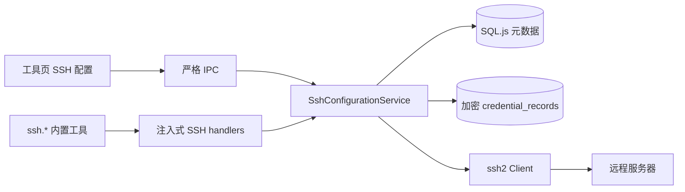
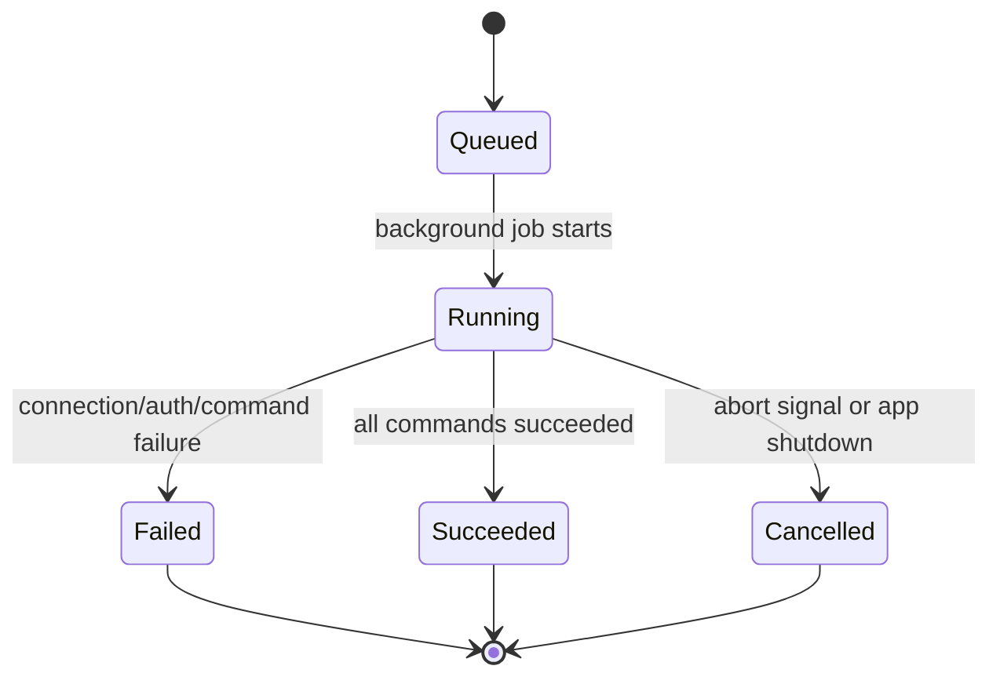

# SSH 工具设计

日期：2026-06-21

## 背景

`hesper-desktop` 已有内置工具体系、工具详情页、全局工具开关、本地加密凭据库、严格 IPC schema、SQL.js 持久化和 agent runtime 工具调用链。用户希望新增 SSH 工具，让 agent 能访问用户在工具页配置的服务器，并在远程服务器上执行多条命令，获得逐条命令输出。

本设计新增一组 SSH 本地服务、持久化表、工具 API、IPC 和工具页配置 UI。敏感信息只保存在本机加密凭据库中，不进入 prompt、agent 工具列表、工具返回值或普通日志。

## 目标

1. 工具页能添加、查看和删除 SSH 私钥。
2. 工具页能添加、查看、编辑和删除 SSH 服务器连接信息，包括 host/IP、端口、用户名、密钥和备注。
3. agent 能读取当前可用服务器列表，但只能看到服务器 `id`、名字和备注。
4. agent 不能获取私钥、passphrase、host/IP、端口、用户名、密钥 ID 或密钥名称。
5. agent 能把多行命令传给 SSH 工具，并指定服务器执行。
6. SSH 工具在一个远程连接内按顺序执行多条命令，并返回每条命令、退出码、stdout、stderr、耗时和状态。
7. `stopOnError: true` 时，遇到第一条失败命令后停止执行，剩余命令标记为 `skipped`。
8. `stopOnError: false` 时，失败命令记录失败结果，后续命令继续执行。
9. SSH 执行默认无超时：`timeoutMs` 缺省或为 `0` 表示不设置超时。
10. agent 能查询当前 session 内正在运行或已完成的 SSH 执行任务列表。
11. agent 能获取当前 session 内指定 SSH 执行任务的当前全部输出；如果任务还在执行，则返回已收集到的输出。
12. 所有 SSH execution 查询严格限制在当前 session，不能跨 session 读取。
13. 第一版默认只把 SSH 工具加入 Main Agent，Worker Agent 默认不带远程执行能力。
14. 实现必须有自动化测试覆盖，遵循现有 TypeScript、Vitest、IPC 和 UI 模式。

## 非目标

第一版不实现：

- 密码登录。
- host key 指纹校验或 known_hosts 管理。
- SFTP 文件传输。
- 端口转发。
- SSH 交互式 shell、PTY 或需要人工输入的命令。
- 跨应用重启后恢复正在运行的 SSH 连接。
- worker-agent 默认获得 SSH 工具。
- 危险命令静态拦截。风险由工具全局开关、会话/角色工具白名单和用户配置控制。

## 方案选择

采用方案 1：**本地 SSH Service + `ssh2` 依赖**。



### 选择原因

- 跨平台稳定，尤其避免 Windows 下依赖系统 `ssh` 可执行文件。
- 私钥和 passphrase 可以直接从加密凭据库读取到内存，不需要写临时私钥文件。
- 工具包仍保持无 app-core 依赖，通过 handler 注入真实服务。
- 后台 execution、实时输出和 session 级查询可以在本地服务中统一维护。

## 数据模型与安全边界

### SSH 密钥元数据

新增共享类型：

```ts
export type SshKey = {
  id: string
  name: string
  note?: string
  hasPassphrase: boolean
  createdAt: string
  updatedAt: string
}
```

私钥内容与 passphrase 不放入 `ssh_keys` 表，而是复用 `credential_records`：

- `ssh-key:<keyId>:private-key`
- `ssh-key:<keyId>:passphrase`

凭据记录的 `kind` 扩展为：

- `provider-api-key`
- `tool-api-key`
- `ssh-private-key`
- `ssh-passphrase`

任何 list/status/delete 结果都不能包含私钥或 passphrase 明文。

### SSH 服务器元数据

新增共享类型：

```ts
export type SshServer = {
  id: string
  name: string
  host: string
  port: number
  username: string
  keyId: string
  note?: string
  createdAt: string
  updatedAt: string
}
```

工具页 UI 可以显示完整服务器配置，因为这是用户的本地管理界面。agent 不能读取完整配置。

### Agent 安全摘要

agent 通过 `ssh.list-servers` 只能得到：

```ts
export type SshServerAgentSummary = {
  id: string
  name: string
  note?: string
}
```

不包含 host/IP、端口、用户名、keyId、keyName、私钥或 passphrase。

### SSH 执行任务

新增 session 级 execution：

```ts
export type SshExecutionStatus = 'queued' | 'running' | 'succeeded' | 'failed' | 'cancelled'
export type SshCommandStatus = 'queued' | 'running' | 'succeeded' | 'failed' | 'skipped' | 'cancelled'

export type SshExecution = {
  id: string
  sessionId: string
  runId: string
  serverId: string
  serverName: string
  commands: string[]
  stopOnError: boolean
  timeoutMs: number
  status: SshExecutionStatus
  startedAt: string
  updatedAt: string
  completedAt?: string
  error?: RunError
}

export type SshCommandResult = {
  executionId: string
  index: number
  command: string
  status: SshCommandStatus
  stdout: string
  stderr: string
  exitCode?: number
  signal?: string
  startedAt?: string
  completedAt?: string
  durationMs?: number
  skippedReason?: string
}
```

`serverName` 是执行时的显示快照，避免服务器改名后历史列表难以辨认。execution 不存 host/IP、用户名、端口、keyId 或密钥内容。

## 持久化

新增表：

```sql
CREATE TABLE IF NOT EXISTS ssh_keys (
  id TEXT PRIMARY KEY,
  name TEXT NOT NULL,
  note TEXT,
  has_passphrase INTEGER NOT NULL,
  created_at TEXT NOT NULL,
  updated_at TEXT NOT NULL,
  sort_seq INTEGER NOT NULL
);
```

```sql
CREATE TABLE IF NOT EXISTS ssh_servers (
  id TEXT PRIMARY KEY,
  name TEXT NOT NULL,
  host TEXT NOT NULL,
  port INTEGER NOT NULL,
  username TEXT NOT NULL,
  key_id TEXT NOT NULL,
  note TEXT,
  created_at TEXT NOT NULL,
  updated_at TEXT NOT NULL,
  sort_seq INTEGER NOT NULL
);
```

```sql
CREATE TABLE IF NOT EXISTS ssh_executions (
  id TEXT PRIMARY KEY,
  session_id TEXT NOT NULL,
  run_id TEXT NOT NULL,
  server_id TEXT NOT NULL,
  server_name TEXT NOT NULL,
  commands_json TEXT NOT NULL,
  stop_on_error INTEGER NOT NULL,
  timeout_ms INTEGER NOT NULL,
  status TEXT NOT NULL,
  started_at TEXT NOT NULL,
  updated_at TEXT NOT NULL,
  completed_at TEXT,
  error_json TEXT,
  sort_seq INTEGER NOT NULL
);
```

```sql
CREATE TABLE IF NOT EXISTS ssh_command_results (
  id TEXT PRIMARY KEY,
  execution_id TEXT NOT NULL,
  command_index INTEGER NOT NULL,
  command TEXT NOT NULL,
  status TEXT NOT NULL,
  stdout TEXT NOT NULL,
  stderr TEXT NOT NULL,
  exit_code INTEGER,
  signal TEXT,
  started_at TEXT,
  completed_at TEXT,
  duration_ms INTEGER,
  skipped_reason TEXT,
  sort_seq INTEGER NOT NULL
);
```

Repository 新增：

- `sshKeys.save/get/list/delete`
- `sshServers.save/get/list/delete/listByKeyId`
- `sshExecutions.save/get/listBySession`
- `sshCommandResults.save/listByExecution`

删除 key 时，如果 `ssh_servers` 仍引用该 key，服务层拒绝删除并提示先删除或修改服务器。

## 工具 API

### `ssh.list-servers`

列出当前可用服务器安全摘要。

输入：

```ts
{}
```

输出：

```ts
{
  servers: [
    { id: 'ssh-server-1', name: '生产跳板机', note: '只用于查看日志' }
  ],
  count: 1
}
```

### `ssh.run-commands`

在指定服务器顺序执行多条命令。

输入：

```ts
{
  serverId: string
  commands: string[]
  stopOnError?: boolean
  timeoutMs?: number
  wait?: boolean
}
```

语义：

- `stopOnError` 默认 `true`。
- `timeoutMs` 默认 `0`，表示不设置超时。
- `wait` 默认 `true`。
- `wait: true` 时，工具调用等待 execution 到达终态后返回当前完整输出。
- `wait: false` 时，工具立即返回 execution 摘要，后台继续执行。

同步返回示例：

```ts
{
  executionId: 'ssh-exec-1',
  serverId: 'ssh-server-1',
  status: 'failed',
  stoppedOnError: true,
  startedAt: '2026-06-21T05:00:00.000Z',
  completedAt: '2026-06-21T05:00:02.000Z',
  results: [
    {
      index: 0,
      command: 'pwd',
      status: 'succeeded',
      exitCode: 0,
      stdout: '/home/deploy\n',
      stderr: '',
      durationMs: 42
    },
    {
      index: 1,
      command: 'whoami',
      status: 'failed',
      exitCode: 1,
      stdout: '',
      stderr: 'permission denied\n',
      durationMs: 31
    },
    {
      index: 2,
      command: 'systemctl status nginx --no-pager',
      status: 'skipped',
      stdout: '',
      stderr: '',
      skippedReason: 'Previous command failed and stopOnError=true'
    }
  ]
}
```

异步返回示例：

```ts
{
  executionId: 'ssh-exec-1',
  serverId: 'ssh-server-1',
  status: 'running',
  startedAt: '2026-06-21T05:00:00.000Z',
  wait: false
}
```

### `ssh.list-executions`

列出当前 `context.sessionId` 内 SSH execution。不能跨 session 查询。

输入：

```ts
{
  status?: 'queued' | 'running' | 'succeeded' | 'failed' | 'cancelled'
}
```

输出：

```ts
{
  executions: [
    {
      id: 'ssh-exec-1',
      serverId: 'ssh-server-1',
      serverName: '生产跳板机',
      status: 'running',
      commandCount: 3,
      completedCommandCount: 1,
      startedAt: '2026-06-21T05:00:00.000Z',
      updatedAt: '2026-06-21T05:00:10.000Z'
    }
  ],
  count: 1
}
```

### `ssh.get-execution-output`

获取当前 `context.sessionId` 内指定 execution 的当前全部输出。不能跨 session 查询。

输入：

```ts
{
  executionId: string
}
```

输出：

```ts
{
  executionId: 'ssh-exec-1',
  serverId: 'ssh-server-1',
  serverName: '生产跳板机',
  status: 'running',
  startedAt: '2026-06-21T05:00:00.000Z',
  updatedAt: '2026-06-21T05:00:10.000Z',
  results: [
    {
      index: 0,
      command: 'pwd',
      status: 'succeeded',
      exitCode: 0,
      stdout: '/home/deploy\n',
      stderr: '',
      durationMs: 42
    },
    {
      index: 1,
      command: 'tail -f app.log',
      status: 'running',
      stdout: 'line1\nline2\n',
      stderr: ''
    }
  ]
}
```

## SSH 执行语义



每次 `ssh.run-commands` 创建一个 execution。服务用内存 registry 维护正在运行的任务：

```ts
type ActiveSshExecution = {
  executionId: string
  sessionId: string
  runId: string
  controller: AbortController
  promise: Promise<void>
}
```

执行规则：

- 每个 execution 建立一个 SSH connection。
- 在同一个 connection 内按 `commands[]` 顺序执行。
- 每条命令用 `ssh2.exec(command)` 独立执行。
- stdout/stderr chunk 到达时立即追加到对应 `ssh_command_results`，因此 `ssh.get-execution-output` 能读取正在执行命令的当前输出。
- `exitCode === 0` 视为成功。
- `exitCode !== 0`、exec stream error、连接错误或认证失败视为失败。
- `stopOnError: true` 遇到失败后，后续命令创建为 `skipped`。
- `stopOnError: false` 继续执行后续命令，最终 execution status 为 `failed`，因为至少一条命令失败。
- 如果所有命令成功，execution status 为 `succeeded`。
- `timeoutMs = 0` 不创建超时定时器。
- `timeoutMs > 0` 时只作用于整个 execution；超时后 abort connection，execution 标记为 `failed`，错误 code 为 `timeout`。

## 服务边界

### `SshConfigurationService`

放在 `@hesper/app-core`，职责：

- SSH key CRUD。
- SSH server CRUD。
- 私钥/passphrase 加密保存、读取、删除。
- agent server safe summary。
- execution 创建、后台执行、session 级列表、输出查询。
- 校验 server key 引用。
- 防止跨 session 查询 execution。

### SSH client adapter

在 `@hesper/app-core` 中定义接口，便于测试替换真实 `ssh2`：

```ts
export type SshClientAdapter = {
  runCommands(input: {
    host: string
    port: number
    username: string
    privateKey: string
    passphrase?: string
    commands: string[]
    stopOnError: boolean
    timeoutMs: number
    signal?: AbortSignal
    onCommandStart(result: SshCommandResult): Promise<void> | void
    onStdout(index: number, chunk: string): Promise<void> | void
    onStderr(index: number, chunk: string): Promise<void> | void
    onCommandComplete(result: SshCommandResult): Promise<void> | void
    onCommandSkipped(result: SshCommandResult): Promise<void> | void
  }): Promise<void>
}
```

真实实现使用 `ssh2@1.17.0`。TypeScript 类型使用 `@types/ssh2@1.15.5`。

### `@hesper/tools` handler 注入

工具包不直接依赖 `app-core` 或 `ssh2`。新增：

```ts
export type SshToolHandlers = {
  listServers(input: Record<string, unknown>, context: ToolExecutionContext): Promise<unknown>
  runCommands(input: Record<string, unknown>, context: ToolExecutionContext): Promise<unknown>
  listExecutions(input: Record<string, unknown>, context: ToolExecutionContext): Promise<unknown>
  getExecutionOutput(input: Record<string, unknown>, context: ToolExecutionContext): Promise<unknown>
}
```

`createBuiltinToolExecutor` 接收 `sshTools?: SshToolHandlers`。未注入 handler 时返回 controlled error。

## IPC 与 UI

### IPC channels

新增严格 schema：

- `sshKeys:list`
- `sshKeys:create`
- `sshKeys:delete`
- `sshServers:list`
- `sshServers:create`
- `sshServers:update`
- `sshServers:delete`

IPC 返回规则：

- key list/create/delete 不返回私钥或 passphrase。
- server list/create/update/delete 给 UI 返回完整非敏感配置：host、port、username、keyId、note。
- create/update server 校验 keyId 存在。
- delete key 如果仍被 server 引用则拒绝。

### 工具页 UI

在工具列表中新增 SSH 工具。选中 SSH 工具时，工具详情页显示专用配置区域：

1. SSH 密钥管理
   - 添加密钥：名称、私钥内容、可选 passphrase、备注。
   - 列表：名称、备注、是否有 passphrase、更新时间。
   - 删除密钥：删除元数据和加密凭据。
   - 保存后清空私钥和 passphrase 输入，不回显。

2. SSH 服务器管理
   - 添加服务器：名称、host/IP、端口、用户名、选择密钥、备注。
   - 列表：名称、host/IP、端口、用户名、密钥名称、备注。
   - 编辑服务器。
   - 删除服务器。

UI 管理页可见 host/IP、端口和用户名；agent 工具返回不可见这些字段。

## 默认工具和角色

新增工具：

- `ssh.list-servers`
- `ssh.run-commands`
- `ssh.list-executions`
- `ssh.get-execution-output`

`ToolDefinition.category` 扩展为包含 `ssh`，或者将 SSH 工具放在现有 `system` 分类。为避免大范围 UI 分类改动，第一版使用 `system` 分类，图标用 `🔐` 或 `🖥️`。

Main Agent 默认工具列表加入四个 SSH 工具。Worker Agent 默认工具列表不加入 SSH 工具。

## 错误处理与信息隐藏

- SSH key 不存在：`SSH key not found: <keyId>` 仅在 UI/service 测试路径出现；agent 执行路径只报 server 配置不可用。
- server 不存在：`SSH server not found: <serverId>`。
- 认证失败：`SSH authentication failed for server: <serverId>`。
- 网络连接失败：不包含 host/IP，返回 `SSH connection failed for server: <serverId>`。
- execution 跨 session 查询：返回 not found，不提示真实 sessionId。
- 所有错误格式不拼接私钥或 passphrase。

## 测试策略

按 TDD 实施：

1. Shared schema
   - SSH key/server/execution/command result schema。
   - Agent summary schema 不包含 host/keyId。

2. Persistence
   - `ssh_keys`、`ssh_servers`、`ssh_executions`、`ssh_command_results` round-trip。
   - migration 在旧 DB 中补表。
   - 删除 key 被 server 引用时服务层拒绝。

3. Credential vault
   - SSH private key/passphrase 加密保存。
   - status/delete 不返回明文。
   - 数据库导出不包含私钥明文。

4. App-core SSH service
   - UI list 返回完整非敏感配置。
   - agent safe list 只返回 id/name/note。
   - `runCommands` 支持 `wait: true` 和 `wait: false`。
   - `stopOnError` true/false 行为。
   - `timeoutMs` 默认 0，不创建超时。
   - `listExecutions` 和 `getExecutionOutput` 限定 session。
   - fake adapter 模拟 stdout/stderr streaming，验证运行中可查询当前输出。

5. Tools executor
   - 四个 SSH 工具定义和 schema。
   - handler delegation。
   - handler 未注入时 controlled error。

6. Electron IPC
   - SSH key/server CRUD。
   - strict schema 拒绝多余字段。
   - IPC 不返回私钥/passphrase。
   - key 被 server 引用时 delete 失败。

7. Renderer UI
   - SSH 工具详情页显示 SSH 配置区。
   - 添加 key 后私钥/passphrase 输入清空。
   - 添加 server 可选择 key。
   - 删除被引用 key 显示错误。

8. 全量验证
   - `pnpm check`。

## 实施顺序

1. 在隔离 worktree 中提交本设计文档。
2. 写正式实施计划，按小任务覆盖 TDD、文件路径、命令和提交点。
3. 用户确认计划后，使用 subagent-driven-development 执行计划。
4. 每个任务由子 agent 实现、测试、提交，并经过 spec compliance review 与 code quality review。
5. 最终运行全量验证并进入收尾流程。
